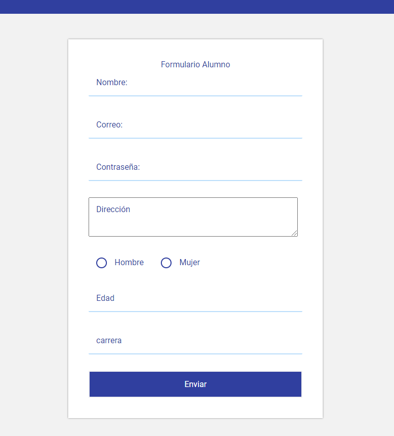

# Interfas-docente-alumno

> Contenido de la cátedra de programación IV-CICLOI-2020

---
## Descripción

practica de programacion programacion IV formularios de alumno y  profesor

---

## Información del autor

- Twitter - [@ThelDaniel23xD](https://twitter.com/ThelDaniel23xD)
- Perfil de github - [TheDaniel23xd](https://github.com/TheDaniel23xd) 

